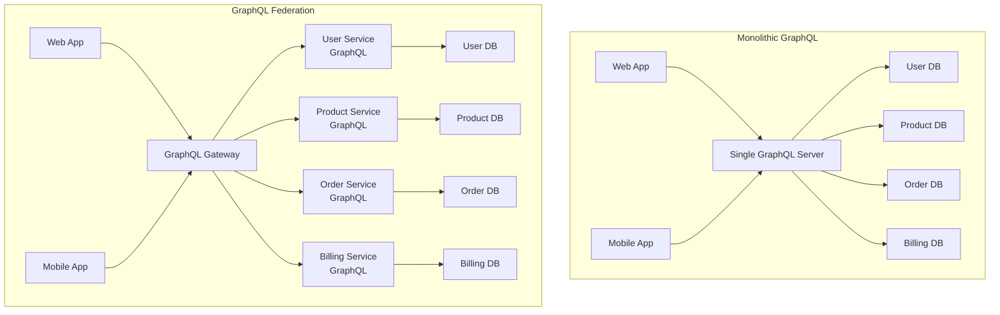
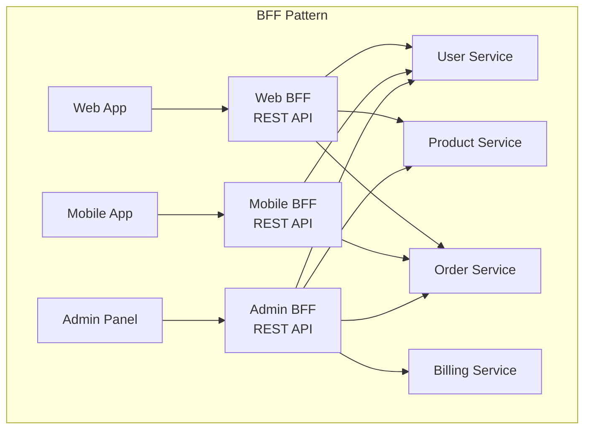
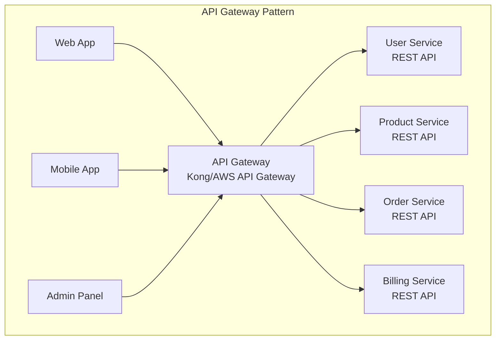
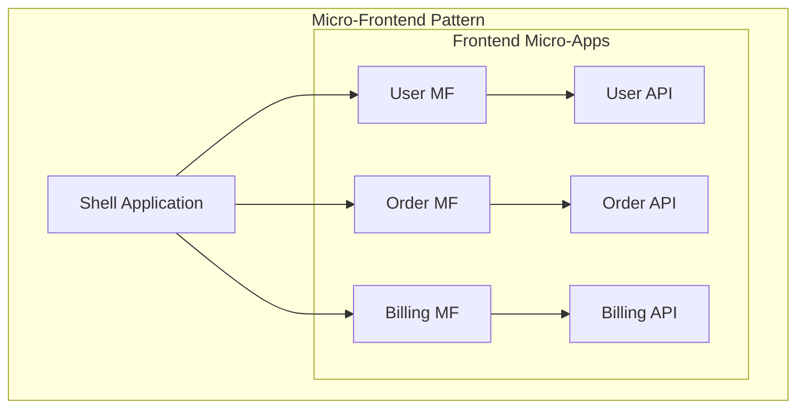

# GraphQL Federation vs Contemporary Implementation Patterns

## What is GraphQL Federation?

GraphQL Federation is a **distributed architecture pattern** where multiple services each own their GraphQL schema and data, but a gateway composes them into a single, unified API. Each service is responsible for its domain while enabling cross-service data relationships.

### **Federation vs Monolithic GraphQL**


## Federation Implementation Deep Dive

### **How Federation Works**
```typescript
// 1. Each service defines its own schema with @key directives
// User Service Schema
const userTypeDefs = gql`
  type User @key(fields: "id") {
    id: ID!
    email: String!
    username: String!
    createdAt: String!
  }
  
  extend type Query {
    user(id: ID!): User
    users: [User!]!
  }
`;

// Order Service Schema - extends User
const orderTypeDefs = gql`
  type Order @key(fields: "id") {
    id: ID!
    userId: String!
    user: User  # Reference to User entity
    total: Float!
    items: [OrderItem!]!
  }
  
  extend type User @key(fields: "id") {
    id: ID! @external
    orders: [Order!]!  # Adds orders field to User
  }
`;

// 2. Gateway automatically composes schemas
const gateway = new ApolloGateway({
  serviceList: [
    { name: 'users', url: 'http://user-service/graphql' },
    { name: 'orders', url: 'http://order-service/graphql' }
  ]
});

// 3. Client queries across services seamlessly
const query = gql`
  query GetUserWithOrders($userId: ID!) {
    user(id: $userId) {
      email
      username
      orders {  # This field comes from Order Service
        id
        total
        items {
          productId
        }
      }
    }
  }
`;
```

### **Federation Query Execution Flow**
```typescript
// Query Planning & Execution
const queryPlan = `
1. Gateway receives query
2. Analyzes which services are needed
3. Creates execution plan:
   - Query user from User Service
   - Use user.id to query orders from Order Service
   - Combine results and return to client
4. Handles authentication/authorization at gateway level
5. Returns unified response
`;

// Example execution plan
const executionPlan = {
  step1: {
    service: 'users',
    query: 'query($userId: ID!) { user(id: $userId) { id email username } }'
  },
  step2: {
    service: 'orders', 
    query: 'query($userId: ID!) { user(id: $userId) { orders { id total items { productId } } } }',
    requires: ['step1.user.id']
  }
};
```

## Contemporary Implementation Patterns Comparison

### **1. Backend for Frontend (BFF) Pattern**


**BFF Implementation:**
```typescript
// Web BFF - Rich data for desktop
class WebBFFController {
  @Get('/dashboard')
  async getDashboard(@Req() req): Promise<DashboardResponse> {
    const [user, orders, analytics, notifications] = await Promise.all([
      this.userService.getUser(req.userId),
      this.orderService.getUserOrders(req.userId, { limit: 10 }),
      this.analyticsService.getUserAnalytics(req.userId),
      this.notificationService.getNotifications(req.userId, { unread: true })
    ]);
    
    return {
      user: {
        ...user,
        profile: await this.userService.getUserProfile(user.id)
      },
      orders: await this.enrichOrdersWithProducts(orders),
      analytics,
      notifications
    };
  }
}

// Mobile BFF - Lightweight data
class MobileBFFController {
  @Get('/dashboard')
  async getDashboard(@Req() req): Promise<MobileDashboardResponse> {
    const [user, orderCount, unreadCount] = await Promise.all([
      this.userService.getUser(req.userId),
      this.orderService.getUserOrderCount(req.userId),
      this.notificationService.getUnreadCount(req.userId)
    ]);
    
    return {
      user: {
        id: user.id,
        username: user.username,
        avatar: user.profile?.avatar
      },
      orderCount,
      unreadCount
    };
  }
}
```

### **2. API Gateway Pattern**


**API Gateway Implementation:**
```yaml
# Kong Gateway Configuration
services:
- name: user-service
  url: http://user-service:3001
  routes:
  - name: user-route
    paths: ["/api/users"]
    methods: ["GET", "POST", "PUT", "DELETE"]

- name: order-service
  url: http://order-service:3002
  routes:
  - name: order-route
    paths: ["/api/orders"]

plugins:
- name: rate-limiting
  config:
    minute: 100
    hour: 1000
- name: authentication
  config:
    provider: jwt
```

**Client-side orchestration:**
```typescript
// Client has to orchestrate multiple API calls
class DashboardService {
  async loadDashboard(userId: string): Promise<DashboardData> {
    // Multiple sequential or parallel calls
    const user = await this.http.get(`/api/users/${userId}`);
    const orders = await this.http.get(`/api/orders?userId=${userId}&limit=5`);
    const billing = await this.http.get(`/api/billing/usage/${user.tenantId}`);
    
    // Client-side data transformation and error handling
    const enrichedOrders = await Promise.all(
      orders.map(async order => ({
        ...order,
        items: await Promise.all(
          order.items.map(item => 
            this.http.get(`/api/products/${item.productId}`)
          )
        )
      }))
    );
    
    return { user, orders: enrichedOrders, billing };
  }
}
```

### **3. Micro-Frontend + API Composition**


**Micro-frontend Implementation:**
```typescript
// Shell Application
class DashboardShell {
  async componentDidMount() {
    // Each micro-frontend manages its own data
    const userWidget = await import('@company/user-widget');
    const orderWidget = await import('@company/order-widget');
    const billingWidget = await import('@company/billing-widget');
    
    this.renderWidget(userWidget, '#user-section');
    this.renderWidget(orderWidget, '#order-section');
    this.renderWidget(billingWidget, '#billing-section');
  }
}

// User Micro-Frontend
class UserWidget {
  async loadData() {
    // Each widget calls its own service
    this.userData = await this.userApi.getCurrentUser();
    this.render();
  }
}
```

### **4. Server-Side Includes (ESI/SSI) Pattern**
```typescript
// Server-side composition
app.get('/dashboard', async (req, res) => {
  const template = `
    <div class="dashboard">
      <!--#include virtual="/widgets/user?userId=${req.userId}" -->
      <!--#include virtual="/widgets/orders?userId=${req.userId}" -->
      <!--#include virtual="/widgets/billing?tenantId=${req.tenantId}" -->
    </div>
  `;
  
  res.send(template);
});
```

## Detailed Pattern Comparison

### **Development Complexity**
```text
┌─────────────────────┬─────────────┬─────────────┬─────────────┬─────────────┐
│ Pattern             │ Backend     │ Frontend    │ DevOps      │ Total       │
├─────────────────────┼─────────────┼─────────────┼─────────────┼─────────────┤
│ GraphQL Federation  │ Medium      │ Low         │ High        │ Medium      │
│ BFF Pattern         │ High        │ Medium      │ Medium      │ High        │
│ API Gateway         │ Low         │ High        │ Low         │ Medium      │
│ Micro-Frontend      │ Low         │ High        │ High        │ High        │
│ SSI/ESI             │ Medium      │ Low         │ Low         │ Low         │
└─────────────────────┴─────────────┴─────────────┴─────────────┴─────────────┘
```

### **Performance Characteristics**
```text
┌─────────────────────┬─────────────┬─────────────┬─────────────┬─────────────┐
│ Pattern             │ Latency     │ Bandwidth   │ Caching     │ Mobile      │
├─────────────────────┼─────────────┼─────────────┼─────────────┼─────────────┤
│ GraphQL Federation  │ Medium      │ Excellent   │ Complex     │ Excellent   │
│ BFF Pattern         │ Low         │ Good        │ Good        │ Good        │
│ API Gateway         │ High        │ Poor        │ Simple      │ Poor        │
│ Micro-Frontend      │ High        │ Poor        │ Complex     │ Poor        │
│ SSI/ESI             │ Low         │ Good        │ Excellent   │ Good        │
└─────────────────────┴─────────────┴─────────────┴─────────────┴─────────────┘
```

### **Mobile-Specific Considerations**

#### **GraphQL Federation for Mobile**
```typescript
// Mobile-optimized queries
const MOBILE_DASHBOARD_QUERY = gql`
  query MobileDashboard {
    me {
      id
      username
      avatar: profile { avatar }  # Only avatar, not full profile
    }
    
    orders(limit: 3) {  # Fewer orders
      id
      total
      status
      # No product details to save bandwidth
    }
    
    notifications(unread: true) {
      count  # Just count, not full notifications
    }
  }
`;

// Desktop query can be much richer
const DESKTOP_DASHBOARD_QUERY = gql`
  query DesktopDashboard {
    me {
      id
      email
      username
      profile {
        firstName
        lastName
        avatar
        bio
        preferences
      }
      tenant {
        name
        settings
        billing {
          plan
          usage
          nextBillingDate
        }
      }
    }
    
    orders(limit: 10) {
      id
      total
      status
      createdAt
      items {
        product {
          name
          image
          category
        }
        quantity
        price
      }
    }
    
    notifications(limit: 20) {
      id
      title
      message
      type
      createdAt
      read
    }
    
    analytics {
      revenue
      orders
      customers
      growth
    }
  }
`;
```

#### **BFF Pattern for Mobile**
```typescript
// Dedicated mobile endpoints
class MobileBFFController {
  @Get('/mobile/dashboard')
  async getMobileDashboard(@Req() req): Promise<MobileDashboard> {
    // Optimized for mobile constraints
    return {
      user: await this.getUserBasicInfo(req.userId),
      ordersSummary: await this.getOrdersSummary(req.userId),
      notificationCount: await this.getUnreadCount(req.userId)
    };
  }
  
  @Get('/mobile/orders')
  async getMobileOrders(@Req() req, @Query() pagination): Promise<MobileOrders> {
    // Paginated, minimal data
    return this.orderService.getMobileOrderList(req.userId, pagination);
  }
}
```

### **Real-World Implementation Scenarios**

#### **Small to Medium SaaS (< 10 services)**
```typescript
// Recommendation: BFF Pattern
const implementation = {
  pattern: 'BFF',
  reasoning: [
    'Lower complexity than federation',
    'Clear separation of concerns',
    'Easy to optimize per client',
    'Familiar REST patterns'
  ],
  cost: '$1,000-3,000/month',
  timeToImplement: '2-4 weeks'
};
```

#### **Large SaaS (10+ services, multiple teams)**
```typescript
// Recommendation: GraphQL Federation
const implementation = {
  pattern: 'GraphQL Federation',
  reasoning: [
    'Team autonomy - each owns their schema',
    'Single API surface for clients',
    'Strong typing across the stack',
    'Excellent mobile optimization'
  ],
  cost: '$2,400-4,000/month',
  timeToImplement: '6-12 weeks'
};
```

#### **Enterprise with Legacy Systems**
```typescript
// Recommendation: API Gateway + Gradual Migration
const implementation = {
  pattern: 'API Gateway',
  reasoning: [
    'Non-disruptive to existing systems',
    'Gradual modernization path',
    'Familiar patterns for enterprise teams',
    'Easy compliance and monitoring'
  ],
  cost: '$500-2,000/month',
  timeToImplement: '1-3 weeks'
};
```

## Mobile Platform Specific Patterns

### **React Native with GraphQL Federation**
```typescript
// Apollo Client with automated caching
const client = new ApolloClient({
  uri: 'https://api.yourapp.com/graphql',
  cache: new InMemoryCache({
    typePolicies: {
      User: {
        fields: {
          orders: {
            merge(existing = [], incoming) {
              return [...existing, ...incoming];
            }
          }
        }
      }
    }
  }),
  defaultOptions: {
    watchQuery: {
      fetchPolicy: 'cache-and-network', // Mobile-optimized
      errorPolicy: 'all'
    }
  }
});

// Offline support
const App = () => (
  <ApolloProvider client={client}>
    <PersistGate loading={<Loading />}>
      <MainApp />
    </PersistGate>
  </ApolloProvider>
);
```

### **Flutter with BFF Pattern**
```dart
// Dedicated mobile API client
class MobileApiClient {
  Future<DashboardData> getDashboard() async {
    final response = await http.get('/api/mobile/dashboard');
    
    if (response.statusCode == 200) {
      return DashboardData.fromJson(jsonDecode(response.body));
    }
    
    throw ApiException('Failed to load dashboard');
  }
  
  // Optimized for mobile data usage
  Future<List<OrderSummary>> getOrdersSummary() async {
    final response = await http.get('/api/mobile/orders/summary');
    return (jsonDecode(response.body) as List)
        .map((json) => OrderSummary.fromJson(json))
        .toList();
  }
}
```

## Key Trade-offs Summary

### **GraphQL Federation Wins When:**
- ✅ Multiple client types with different data needs
- ✅ Strong typing requirements
- ✅ Mobile-first strategy
- ✅ Team wants unified developer experience
- ✅ Complex data relationships across services

### **BFF Pattern Wins When:**
- ✅ Clear client-specific optimizations needed
- ✅ Team prefers REST patterns
- ✅ Simpler operational overhead acceptable
- ✅ Different authentication per client type

### **API Gateway Wins When:**
- ✅ Legacy system integration priority
- ✅ Simple CRUD operations dominate
- ✅ Enterprise compliance requirements
- ✅ Minimal learning curve needed

**Bottom Line:** For modern SaaS platforms with mobile apps, GraphQL Federation provides the best developer experience and mobile optimization, but requires higher initial investment. BFF pattern offers a good middle ground with familiar patterns and lower complexity.