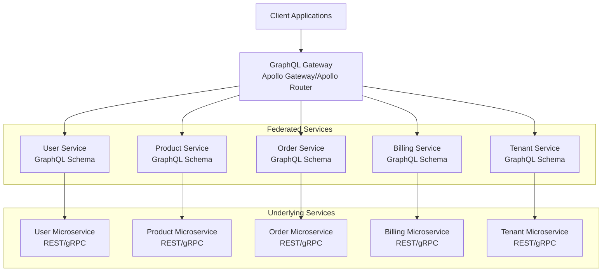

# GraphQL in SaaS Architecture: Deep Dive & Cost Analysis

## What is GraphQL in This Context?

GraphQL acts as a **unified API layer** that sits between your frontend applications and your microservices. Instead of making multiple REST API calls to different services, clients can fetch all required data in a single request with exactly the fields they need.

## GraphQL Federation Architecture

### **How It Works**


### **Federation Implementation Example**
```typescript
// User Service - Federated Schema
import { buildSubgraphSchema } from '@apollo/federation';

const typeDefs = gql`
  type User @key(fields: "id") {
    id: ID!
    email: String!
    username: String!
    profile: UserProfile
    tenantId: String!
  }
  
  type UserProfile {
    firstName: String
    lastName: String
    avatar: String
  }
  
  extend type Query {
    user(id: ID!): User
    me: User
  }
  
  extend type Mutation {
    updateProfile(input: UpdateProfileInput!): User
  }
`;

const resolvers = {
  User: {
    __resolveReference(user: { id: string }) {
      return userService.findById(user.id);
    },
    profile(user: User) {
      return userService.getUserProfile(user.id);
    }
  },
  Query: {
    user: (_, { id }) => userService.findById(id),
    me: (_, __, { userId }) => userService.findById(userId)
  }
};

export const schema = buildSubgraphSchema({ typeDefs, resolvers });
```

```typescript
// Order Service - References User
const typeDefs = gql`
  type Order @key(fields: "id") {
    id: ID!
    userId: String!
    user: User  # Reference to User from User Service
    items: [OrderItem!]!
    total: Float!
    status: OrderStatus!
    createdAt: String!
  }
  
  type OrderItem {
    productId: String!
    product: Product  # Reference to Product from Product Service
    quantity: Int!
    price: Float!
  }
  
  extend type User @key(fields: "id") {
    id: ID! @external
    orders: [Order!]!  # Extend User with orders
  }
  
  extend type Query {
    order(id: ID!): Order
    orders(userId: ID!): [Order!]!
  }
`;

const resolvers = {
  Order: {
    user(order: Order) {
      return { __typename: 'User', id: order.userId };
    }
  },
  User: {
    orders(user: { id: string }) {
      return orderService.getOrdersByUser(user.id);
    }
  }
};
```

```typescript
// Gateway Configuration
import { ApolloGateway } from '@apollo/gateway';

const gateway = new ApolloGateway({
  serviceList: [
    { name: 'users', url: 'http://user-service:4001/graphql' },
    { name: 'products', url: 'http://product-service:4002/graphql' },
    { name: 'orders', url: 'http://order-service:4003/graphql' },
    { name: 'billing', url: 'http://billing-service:4004/graphql' },
    { name: 'tenants', url: 'http://tenant-service:4005/graphql' }
  ],
  buildService({ url }) {
    return new RemoteGraphQLDataSource({
      url,
      willSendRequest({ request, context }) {
        // Forward authentication headers
        request.http.headers.set('authorization', context.authToken);
        request.http.headers.set('x-tenant-id', context.tenantId);
      }
    });
  }
});
```

## Key Advantages in SaaS Architecture

### **1. Unified Developer Experience**
```typescript
// Single Query for Complex UI
const GET_DASHBOARD_DATA = gql`
  query GetDashboardData($userId: ID!) {
    me {
      id
      email
      profile {
        firstName
        avatar
      }
      tenant {
        name
        subscriptionPlan {
          name
          features
        }
        usage {
          apiCalls
          storage
          users
        }
      }
      orders(limit: 5) {
        id
        total
        status
        items {
          product {
            name
            image
          }
          quantity
        }
      }
    }
    
    analytics {
      revenue
      activeUsers
      apiUsage
    }
  }
`;

// This single request replaces 5-6 REST API calls:
// - GET /users/me
// - GET /users/me/profile
// - GET /tenants/:id
// - GET /billing/usage/:tenantId
// - GET /orders?userId=:id&limit=5
// - GET /analytics/dashboard
```

### **2. Strongly Typed & Self-Documenting**
```typescript
// Auto-generated TypeScript types
type DashboardQuery = {
  me: {
    id: string;
    email: string;
    profile: {
      firstName: string;
      avatar: string;
    };
    tenant: {
      name: string;
      subscriptionPlan: {
        name: string;
        features: string[];
      };
    };
    orders: Array<{
      id: string;
      total: number;
      status: OrderStatus;
      items: Array<{
        product: {
          name: string;
          image: string;
        };
        quantity: number;
      }>;
    }>;
  };
  analytics: {
    revenue: number;
    activeUsers: number;
    apiUsage: number;
  };
};
```

### **3. Mobile-First Optimization**
```graphql
# Mobile query - minimal data
query GetMobileUserData {
  me {
    id
    username
    profile {
      avatar
    }
    notifications(unread: true) {
      count
    }
  }
}

# Desktop query - rich data
query GetDesktopUserData {
  me {
    id
    username
    email
    profile {
      firstName
      lastName
      avatar
      bio
      preferences
    }
    tenant {
      name
      settings
      billing {
        currentPlan
        usage
        nextBillingDate
      }
    }
    notifications(limit: 20) {
      id
      title
      message
      createdAt
      read
    }
    recentActivity {
      timestamp
      action
      resource
    }
  }
}
```

### **4. Real-time Subscriptions**
```typescript
// Real-time updates
const ORDER_UPDATES = gql`
  subscription OrderUpdates($userId: ID!) {
    orderStatusChanged(userId: $userId) {
      id
      status
      updatedAt
      user {
        email
      }
      items {
        product {
          name
        }
      }
    }
  }
`;

// Notification subscriptions
const NOTIFICATION_SUBSCRIPTION = gql`
  subscription NotificationUpdates {
    notificationReceived {
      id
      title
      message
      type
      createdAt
    }
  }
`;
```

### **5. Flexible Authorization**
```typescript
// Field-level authorization
const resolvers = {
  User: {
    email: (user, args, context) => {
      // Only show email to self or admins
      if (context.userId === user.id || context.hasRole('admin')) {
        return user.email;
      }
      return null;
    },
    
    billing: (user, args, context) => {
      // Only show billing to self or billing admins
      if (context.userId === user.id || context.hasPermission('billing:read')) {
        return billingService.getUserBilling(user.id);
      }
      throw new ForbiddenError('Access denied');
    }
  },
  
  Tenant: {
    analytics: (tenant, args, context) => {
      // Tenant-specific data isolation
      if (context.tenantId !== tenant.id) {
        throw new ForbiddenError('Access denied');
      }
      return analyticsService.getTenantAnalytics(tenant.id);
    }
  }
};
```

## Operational Cost Analysis

### **Infrastructure Costs**

#### **Additional Components**
```yaml
# GraphQL Gateway (Apollo Router)
resources:
  requests:
    cpu: 100m
    memory: 256Mi
  limits:
    cpu: 500m
    memory: 512Mi
replicas: 3
# Monthly cost: ~$45-90 (depending on cloud provider)

# Schema Registry (Apollo Studio)
apollo_studio_plan: "Team"  # $99/month
# OR self-hosted schema registry: ~$20-40/month
```

#### **Cost Breakdown**
```text
GraphQL Infrastructure Costs (Monthly):
┌─────────────────────────┬──────────────────┬─────────────┐
│ Component               │ Self-Hosted      │ Managed     │
├─────────────────────────┼──────────────────┼─────────────┤
│ GraphQL Gateway (3x)    │ $45-90          │ $200-400    │
│ Schema Registry         │ $20-40          │ $99-299     │
│ Monitoring/Analytics    │ $10-20          │ $50-100     │
│ Load Balancer          │ $15-25          │ Included    │
├─────────────────────────┼──────────────────┼─────────────┤
│ Total                   │ $90-175         │ $349-799    │
└─────────────────────────┴──────────────────┴─────────────┘

Additional bandwidth costs: 10-15% increase due to larger payloads
But offset by 40-60% reduction in total requests
```

### **Development & Operational Costs**

#### **Initial Setup (One-time)**
```text
Development Effort:
┌─────────────────────────┬──────────────────┬─────────────┐
│ Task                    │ Developer Days   │ Cost        │
├─────────────────────────┼──────────────────┼─────────────┤
│ Gateway Setup           │ 3-5 days        │ $2,400-4,000│
│ Schema Design           │ 5-8 days        │ $4,000-6,400│
│ Federation Setup        │ 8-12 days       │ $6,400-9,600│
│ Client Integration      │ 10-15 days      │ $8,000-12,000│
│ Testing & Documentation │ 5-8 days        │ $4,000-6,400│
├─────────────────────────┼──────────────────┼─────────────┤
│ Total                   │ 31-48 days      │ $24,800-38,400│
└─────────────────────────┴──────────────────┴─────────────┘
```

#### **Ongoing Operational Costs**
```text
Monthly Operational Overhead:
┌─────────────────────────┬──────────────────┬─────────────┐
│ Aspect                  │ Additional Hours │ Monthly Cost│
├─────────────────────────┼──────────────────┼─────────────┤
│ Schema Maintenance      │ 8-12 hours      │ $800-1,200 │
│ Performance Monitoring  │ 4-6 hours       │ $400-600   │
│ Query Optimization      │ 6-10 hours      │ $600-1,000 │
│ Security Reviews        │ 2-4 hours       │ $200-400   │
├─────────────────────────┼──────────────────┼─────────────┤
│ Total                   │ 20-32 hours     │ $2,000-3,200│
└─────────────────────────┴──────────────────┴─────────────┘
```

### **Cost-Benefit Analysis**

#### **Cost Savings**
```text
GraphQL Benefits (Monthly Savings):
┌─────────────────────────┬──────────────────┬─────────────┐
│ Savings Area            │ Reduction        │ Value       │
├─────────────────────────┼──────────────────┼─────────────┤
│ Frontend Development    │ 30-40% faster   │ $3,000-5,000│
│ Mobile Data Usage       │ 50-70% less     │ $500-1,500 │
│ API Gateway Costs       │ 40-60% less     │ $200-800   │
│ CDN/Bandwidth          │ 30-50% less     │ $100-500   │
│ Backend API Calls       │ 50-70% less     │ $300-1,000 │
│ Customer Support        │ Better DX       │ $500-1,500 │
├─────────────────────────┼──────────────────┼─────────────┤
│ Total Monthly Savings   │                  │ $4,600-10,300│
└─────────────────────────┴──────────────────┴─────────────┘

ROI Calculation:
Monthly Costs: $2,400-4,000
Monthly Savings: $4,600-10,300
Net Monthly Benefit: $2,200-6,300
Payback Period: 4-6 months
```

### **Performance Considerations**

#### **Query Complexity Management**
```typescript
// Query depth limiting
const depthLimit = require('graphql-depth-limit');

const server = new ApolloServer({
  schema,
  validationRules: [depthLimit(7)],
  plugins: [
    {
      requestDidStart() {
        return {
          willSendResponse(requestContext) {
            // Query cost analysis
            const complexity = calculateQueryComplexity({
              estimators: [
                fieldExtensionsEstimator(),
                simpleEstimator({ maximumCost: 1000 })
              ],
              schema,
              query: requestContext.request.query
            });
            
            if (complexity > 1000) {
              throw new Error('Query too complex');
            }
          }
        };
      }
    }
  ]
});
```

#### **Caching Strategy**
```typescript
// Multi-level caching
const server = new ApolloServer({
  schema,
  plugins: [
    responseCachePlugin({
      sessionId: (requestContext) => {
        return requestContext.request.http.headers.get('authorization');
      },
      cache: new KeyvAdapter(redis),
      ttl: {
        default: 300, // 5 minutes
        maxAge: 3600   // 1 hour max
      }
    })
  ],
  dataSources: () => ({
    userAPI: new UserAPI(),
    productAPI: new ProductAPI()
  })
});

// DataLoader for N+1 problem prevention
class UserAPI extends RESTDataSource {
  constructor() {
    super();
    this.userLoader = new DataLoader(async (userIds) => {
      const users = await this.getUsersByIds(userIds);
      return userIds.map(id => users.find(user => user.id === id));
    });
  }
  
  getUser(id) {
    return this.userLoader.load(id);
  }
}
```

## When GraphQL Makes Sense vs. When It Doesn't

### **Use GraphQL When:**
- ✅ Complex, interconnected data relationships
- ✅ Multiple client types (web, mobile, admin)
- ✅ Rapid frontend iteration needs
- ✅ Mobile-first applications with bandwidth concerns
- ✅ Developer experience is prioritized
- ✅ Team has GraphQL expertise or budget for training

### **Skip GraphQL When:**
- ❌ Simple CRUD applications
- ❌ File upload/download heavy use cases
- ❌ Real-time gaming or IoT with microsecond latency needs
- ❌ Small team without GraphQL experience
- ❌ Budget constraints for additional infrastructure
- ❌ Existing REST APIs work well and clients are satisfied

## Recommended Implementation Approach

### **Phase 1: Pilot (Months 1-2)**
- Implement GraphQL for one domain (e.g., User Management)
- Use Apollo Server with existing REST services as data sources
- Cost: ~$1,000-2,000/month

### **Phase 2: Federation (Months 3-4)**
- Add 2-3 more services to federation
- Implement proper caching and optimization
- Cost: ~$2,000-3,000/month

### **Phase 3: Full Implementation (Months 5-6)**
- Migrate all services to GraphQL federation
- Advanced features: subscriptions, federation v2
- Cost: ~$2,400-4,000/month (steady state)

## Conclusion

GraphQL adds **$2,400-4,000/month** in operational costs but typically saves **$4,600-10,300/month** through improved developer productivity, reduced bandwidth, and better user experience. The net benefit of **$2,200-6,300/month** plus 4-6 month payback period makes it a strong investment for most SaaS platforms handling complex data relationships and multiple client types.