# Modern SaaS Platform Architecture

## Executive Summary

This document outlines a modern, scalable, and cost-effective SaaS platform architecture designed for rapid product development and deployment. The architecture emphasizes developer experience, security, database agnosticism, and domain flexibility while maintaining operational efficiency.

## Architecture Diagram

```mermaid
graph TB
    %% Client Layer
    subgraph "Client Layer"
        WEB[Web Application<br/>React/Next.js]
        MOBILE[Mobile Apps<br/>React Native/Flutter]
        API_CLIENT[API Clients<br/>SDKs]
    end

    %% Edge Layer
    subgraph "Edge & CDN Layer"
        CDN[Global CDN<br/>CloudFlare/AWS CloudFront]
        WAF[Web Application Firewall]
        EDGE[Edge Functions<br/>Serverless@Edge]
    end

    %% API Gateway & Load Balancer
    subgraph "API Gateway Layer"
        LB[Load Balancer<br/>Application Load Balancer]
        GATEWAY[API Gateway<br/>Kong/AWS API Gateway]
        RATE[Rate Limiting]
        AUTH_GATE[Authentication Gateway]
    end

    %% Microservices Layer
    subgraph "Application Layer"
        subgraph "Core Services"
            USER_SVC[User Service]
            AUTH_SVC[Auth Service]
            TENANT_SVC[Tenant Service]
            BILLING_SVC[Billing Service]
        end
        
        subgraph "Domain Services"
            DOMAIN_A[Domain Service A]
            DOMAIN_B[Domain Service B]
            DOMAIN_N[Domain Service N]
        end
        
        subgraph "Platform Services"
            NOTIFICATION[Notification Service]
            AUDIT[Audit Service]
            ANALYTICS[Analytics Service]
            FILE_SVC[File Service]
        end
    end

    %% Event Streaming
    subgraph "Event Streaming"
        EVENT_BUS[Event Bus<br/>Apache Kafka/AWS EventBridge]
        STREAM[Stream Processing<br/>Apache Flink/Kinesis]
    end

    %% Data Layer
    subgraph "Data Layer"
        subgraph "Primary Storage"
            DB_ABSTRACTION[Database Abstraction Layer<br/>Prisma/TypeORM]
            POSTGRES[PostgreSQL<br/>Primary Database]
            MONGODB[MongoDB<br/>Document Store]
            REDIS[Redis<br/>Cache & Sessions]
        end
        
        subgraph "Storage & Search"
            S3[Object Storage<br/>S3/MinIO]
            ELASTIC[Elasticsearch<br/>Search Engine]
            WAREHOUSE[Data Warehouse<br/>ClickHouse/BigQuery]
        end
    end

    %% Infrastructure Layer
    subgraph "Infrastructure & Orchestration"
        K8S[Kubernetes Cluster<br/>Auto-scaling]
        ISTIO[Service Mesh<br/>Istio/Linkerd]
        MONITORING[Monitoring<br/>Prometheus/Grafana]
        LOGGING[Centralized Logging<br/>ELK Stack]
    end

    %% Security Layer
    subgraph "Security & Compliance"
        VAULT[Secrets Management<br/>HashiCorp Vault]
        COMPLIANCE[Compliance<br/>SOC2/GDPR]
        BACKUP[Backup & DR<br/>Cross-region]
        ENCRYPTION[Encryption at Rest/Transit]
    end

    %% DevOps & CI/CD
    subgraph "DevOps Pipeline"
        GIT[Git Repository<br/>GitHub/GitLab]
        CI_CD[CI/CD Pipeline<br/>GitHub Actions/ArgoCD]
        REGISTRY[Container Registry]
        GITOPS[GitOps Deployment]
    end

    %% Connections
    WEB --> CDN
    MOBILE --> CDN
    API_CLIENT --> CDN
    CDN --> WAF
    WAF --> LB
    LB --> GATEWAY
    GATEWAY --> USER_SVC
    GATEWAY --> AUTH_SVC
    GATEWAY --> TENANT_SVC
    GATEWAY --> BILLING_SVC
    GATEWAY --> DOMAIN_A
    GATEWAY --> DOMAIN_B
    GATEWAY --> DOMAIN_N
    GATEWAY --> NOTIFICATION
    GATEWAY --> AUDIT
    GATEWAY --> ANALYTICS
    GATEWAY --> FILE_SVC

    USER_SVC --> EVENT_BUS
    AUTH_SVC --> EVENT_BUS
    TENANT_SVC --> EVENT_BUS
    BILLING_SVC --> EVENT_BUS
    DOMAIN_A --> EVENT_BUS
    DOMAIN_B --> EVENT_BUS
    DOMAIN_N --> EVENT_BUS

    EVENT_BUS --> STREAM
    STREAM --> WAREHOUSE

    USER_SVC --> DB_ABSTRACTION
    AUTH_SVC --> DB_ABSTRACTION
    TENANT_SVC --> DB_ABSTRACTION
    BILLING_SVC --> DB_ABSTRACTION
    DOMAIN_A --> DB_ABSTRACTION
    DOMAIN_B --> DB_ABSTRACTION
    DOMAIN_N --> DB_ABSTRACTION

    DB_ABSTRACTION --> POSTGRES
    DB_ABSTRACTION --> MONGODB
    DB_ABSTRACTION --> REDIS

    FILE_SVC --> S3
    ANALYTICS --> ELASTIC
    ANALYTICS --> WAREHOUSE

    K8S --> ISTIO
    K8S --> MONITORING
    K8S --> LOGGING

    CI_CD --> REGISTRY
    CI_CD --> K8S
    GIT --> CI_CD
    GITOPS --> K8S

    VAULT --> K8S
    VAULT --> DB_ABSTRACTION
```

## Core Architecture Principles

### 1. **Microservices with Domain-Driven Design**
The architecture employs a microservices pattern organized around business domains. Each service owns its data and business logic, enabling independent development, deployment, and scaling. Core services handle platform-wide concerns (authentication, billing, tenancy), while domain services implement specific business logic.

### 2. **Database Agnosticism**
A database abstraction layer (using tools like Prisma or TypeORM) provides a unified interface across different database technologies. This allows teams to choose the best database for their specific use case while maintaining consistency in development patterns.

### 3. **Event-Driven Architecture**
An event bus (Apache Kafka or AWS EventBridge) enables loose coupling between services. Services communicate through events, allowing for better scalability, fault tolerance, and the ability to add new functionality without modifying existing services.

### 4. **Container-First Deployment**
Kubernetes orchestrates containerized services, providing automatic scaling, self-healing, and rolling deployments. A service mesh (Istio/Linkerd) handles service-to-service communication, security, and observability.

## Technology Stack

### **Frontend & Client Layer**
- **Web Applications**: React/Next.js with TypeScript for type safety and developer experience
- **Mobile Applications**: React Native or Flutter for cross-platform development
- **API Client SDKs**: Auto-generated from OpenAPI specifications for consistent client integration

### **Backend Services**
- **Runtime**: Node.js/TypeScript or Go for high-performance services
- **API Framework**: Express.js, Fastify, or Gin for REST APIs
- **GraphQL**: Apollo Server for flexible data fetching
- **gRPC**: For high-performance service-to-service communication

### **Data & Storage**
- **Primary Database**: PostgreSQL for ACID compliance and complex queries
- **Document Store**: MongoDB for flexible, schema-less data
- **Cache**: Redis for session storage, caching, and pub/sub
- **Object Storage**: S3 or MinIO for file storage
- **Search**: Elasticsearch for full-text search and analytics
- **Data Warehouse**: ClickHouse or BigQuery for analytics

### **Infrastructure & DevOps**
- **Orchestration**: Kubernetes with Helm charts
- **Service Mesh**: Istio for traffic management and security
- **CI/CD**: GitHub Actions or GitLab CI with ArgoCD for GitOps
- **Monitoring**: Prometheus, Grafana, and Jaeger for observability
- **Logging**: ELK Stack (Elasticsearch, Logstash, Kibana)

## Key Features for Developer Experience

### 1. **Developer Portal & Documentation**
- Interactive API documentation with Swagger/OpenAPI
- Code examples and SDKs in multiple languages
- Local development environment with Docker Compose
- Automated testing and quality gates

### 2. **Standardized Development Workflow**
- Code generation from schemas (OpenAPI, GraphQL, gRPC)
- Consistent project templates and scaffolding
- Pre-commit hooks for code quality and security scanning
- Automated dependency updates and vulnerability scanning

### 3. **Observability & Debugging**
- Distributed tracing across all services
- Centralized logging with correlation IDs
- Real-time metrics and alerting
- Performance monitoring and profiling

## Security & Compliance

### **Authentication & Authorization**
- OAuth 2.0/OIDC with JWT tokens
- Role-based access control (RBAC) with fine-grained permissions
- Multi-factor authentication and SSO integration
- API key management for service-to-service communication

### **Data Protection**
- Encryption at rest and in transit (TLS 1.3)
- Secrets management with HashiCorp Vault
- Data anonymization and GDPR compliance tools
- Regular security audits and penetration testing

### **Infrastructure Security**
- Network segmentation and zero-trust networking
- Container image scanning and vulnerability management
- Infrastructure as Code (IaC) with Terraform
- Automated backup and disaster recovery

## Cost Optimization Strategies

### **Resource Efficiency**
- Horizontal Pod Autoscaler (HPA) for automatic scaling
- Spot instances for non-critical workloads
- Resource quotas and limits to prevent over-provisioning
- Multi-cloud strategy to leverage competitive pricing

### **Operational Efficiency**
- GitOps for automated deployments and reduced operational overhead
- Self-service developer tools to reduce support tickets
- Automated testing and quality gates to prevent production issues
- Proactive monitoring and alerting to prevent outages

## Scalability & Performance

### **Horizontal Scaling**
- Stateless services for easy horizontal scaling
- Database read replicas and connection pooling
- CDN for global content delivery
- Event sourcing for high-throughput scenarios

### **Performance Optimization**
- Caching strategies at multiple layers (CDN, application, database)
- Asynchronous processing for long-running tasks
- Database indexing and query optimization
- Service-level objectives (SLOs) and performance budgets

## Conclusion

This architecture provides a solid foundation for building modern SaaS platforms that can scale from startup to enterprise. The focus on developer experience, combined with robust security and cost optimization, ensures teams can ship products quickly while maintaining high quality and compliance standards. The modular design allows for incremental adoption and customization based on specific business requirements.

The architecture balances complexity with pragmatism, providing powerful capabilities while remaining approachable for development teams of various sizes and experience levels.